# Machine Learning Engineer Nanodegree
## Capstone Project
Ian Gregson

December 19 2018

# 1. Definition

### Project Overview

The domain background for this project is that it comes directly from my work for a startup that is building a customer data platform that helps users maximize their account based recurring revenue. In this field, BizOps profressional leverage large quantities of data from multiple sources such as CRMs or customer engagement analytics tools. The platform we build collates thiss data to provide a single view of an account (a non trivial problem in this space) but much of the insights that are gleaned from this large quantity of data come from the judgements of BizOps professionals studying the data.

The project seeks to take steps into a new way of deriving insights from this large suite of structured data. By automating some aspects of the data analysis with machine learning models will free up the professionals to apply their extensive domain expertise in solving new problems.

I have a personal motivation in undertaking this project because I want to help push my team to become leaders in our field.

### Problem Statement

The problem to be solved in this project is the problem of opportunity classification. There is historical data that shows which opportunities eventually convert to become accounts with annually recurring revenue. BizOps practitioners will use this historical data to make judgements on what active oppoortunities are most likely to convert by comparing their features with the features of examples from the historical data.

This project seeks to build a machine learning model that will make these judgements.

To build that model, this project will work through the following steps:

* Establish and prepare evaluation metrics
* Explore the dataset and establish necessary pre-processing steps
* Establish a benchmark using a dummy classifier
* Carry out pre-processing of the dataset
* Implement a number of models with their default parameters
* Train and cross validate the models on the dataset
* Refine the models that looks to have the best performance using grid search to find the best hyperparameters
* Evaluate the performance of the model on the dataset against the benchmark and establish whether or not the model is viable for further use

The model will be deemed acceptable for furhter use if the predictions it makes are better than those returned by the dummy classifier.


### Metrics

Since this project aims to solve a classification problem, I expect the F1 Score metric will provide suitable evaluation of the performance of the benchmark and solution models.

The F1 Score will provide a numeric means of judging the performance that can help more definiteively assess the performance of final model and ascertain whether or not it can be used further for opportunity classification. The F1 Score metric should help give a good balance between _recall_ and _precision_ since it is unlikely the dataset will have an equal of number of samples in each of the two classes.

```python
from sklearn.metrics import f1_score, make_scorer
f1_scorer = make_scorer(f1_score)
```

## 2. Analysis

### Data Exploration
<!--

```python
import pandas as pd
raw_data = pd.read_csv('data/csv/raw_data.csv', low_memory=False)
```

-->

Firstly the raw dataset is loaded up in a Pandas DataFrame and inspected using the `.info()` method.

<!--
```python
display(raw_data.info())
```
-->
    <class 'pandas.core.frame.DataFrame'>
    RangeIndex: 33338 entries, 0 to 33337
    Data columns (total 58 columns):
    Account_Region__c                             25312 non-null object
    Account_Theater__c                            10070 non-null object
    ACV__c                                        33338 non-null float64
    C_Contact_has_accepted_a_follow_on_step__c    33338 non-null bool
    Consulting_Services_Amount__c                 33338 non-null float64
    Created_by_Role__c                            33338 non-null object
    Deal_Type__c                                  781 non-null object
    Decision_Process__c                           0 non-null float64
    Delivery_Type__c                              2 non-null object
    Deployment_timeframe__c                       11 non-null object
    Difference_between_Created_and_Modified__c    33338 non-null float64
    DM_Close_Type__c                              33338 non-null object
    DM_Opp_Age__c                                 33338 non-null float64
    DM_Playbook_Stage__c                          22767 non-null object
    DM_Playbook_Status__c                         33338 non-null object
    Engagement_Mode__c                            18933 non-null object
    Exchange_Reuse_Mgr__c                         33338 non-null bool
    Follow_on_Meeting_Completed__c                33338 non-null bool
    Follow_on_meeting_scheduled__c                33338 non-null bool
    forecast__c                                   31570 non-null object
    ForecastCategory                              33338 non-null object
    HasOpportunityLineItem                        33338 non-null bool
    Inbound__c                                    33338 non-null bool
    Inbound_Source__c                             0 non-null float64
    IsClosed                                      33338 non-null bool
    IsSplit                                       33338 non-null bool
    IsWon                                         33338 non-null bool
    Key_Account__c                                33338 non-null bool
    Large_Deal__c                                 33338 non-null bool
    Lead_Passed_By_Group__c                       14124 non-null object
    Lead_Passed_By_Name__c                        14823 non-null object
    Lead_Passed_By_Role__c                        14803 non-null object
    LeadSource                                    18209 non-null object
    Lead_Source_Asset__c                          14519 non-null object
    Lead_Source_Detail__c                         14832 non-null object
    Lead_Type__c                                  33296 non-null object
    Metric_Accept2Close__c                        33338 non-null float64
    Metric_Create2Close__c                        33338 non-null float64
    M_Is_decision_maker_mobilizer_champ__c        33338 non-null bool
    N_Contact_has_bus_tech_goal_to_address__c     33338 non-null bool
    New_and_Add_On_Subscription__c                27886 non-null float64
    New_Business_Subscription__c                  14184 non-null float64
    Number_of_Products__c                         33338 non-null float64
    OA_Project_Prefix__c                          33338 non-null object
    Opportunity_Classification__c                 18682 non-null object
    Opportunity_Contact_Roles__c                  26576 non-null float64
    Opportunity_Source__c                         32330 non-null object
    Sales_Channel__c                              31384 non-null object
    Services_Amount__c                            33338 non-null float64
    Services_Attached__c                          33338 non-null bool
    Stage__c                                      33338 non-null object
    Subscr_Fields_Not_Populated__c                33338 non-null float64
    Subscription_Amount__c                        33338 non-null float64
    Total_List_Price__c                           33338 non-null float64
    Who_is_leading_the_sale__c                    3554 non-null object
    Amount                                        31845 non-null float64
    StageName                                     33338 non-null object
    Type                                          32928 non-null object
    dtypes: bool(14), float64(17), object(27)
    memory usage: 11.6+ MB


    None


This reveals that the dataset has 58 features and 33338 samples. Some of the features have no null values, some features have many samples that are null values and some have no values at all. Also, the features are a mix of data types indicating that there are number of categorical features in the dataset.

Next the `.describe()` and `.head()` methods are used to allow a visual inspection of the data itself.
<!--
```python
raw_data.describe()
```
-->


<div>
<style scoped>
    .dataframe tbody tr th:only-of-type {
        vertical-align: middle;
    }

    .dataframe tbody tr th {
        vertical-align: top;
    }

    .dataframe thead th {
        text-align: right;
    }
</style>
<table border="1" class="dataframe">
  <thead>
    <tr style="text-align: right;">
      <th></th>
      <th>ACV__c</th>
      <th>Consulting_Services_Amount__c</th>
      <th>Decision_Process__c</th>
      <th>Difference_between_Created_and_Modified__c</th>
      <th>DM_Opp_Age__c</th>
      <th>Inbound_Source__c</th>
      <th>Metric_Accept2Close__c</th>
      <th>Metric_Create2Close__c</th>
      <th>New_and_Add_On_Subscription__c</th>
      <th>New_Business_Subscription__c</th>
      <th>Number_of_Products__c</th>
      <th>Opportunity_Contact_Roles__c</th>
      <th>Services_Amount__c</th>
      <th>Subscr_Fields_Not_Populated__c</th>
      <th>Subscription_Amount__c</th>
      <th>Total_List_Price__c</th>
      <th>Amount</th>
    </tr>
  </thead>
  <tbody>
    <tr>
      <th>count</th>
      <td>3.333800e+04</td>
      <td>3.333800e+04</td>
      <td>0.0</td>
      <td>33338.000000</td>
      <td>33338.000000</td>
      <td>0.0</td>
      <td>33338.000000</td>
      <td>33338.000000</td>
      <td>2.788600e+04</td>
      <td>1.418400e+04</td>
      <td>33338.000000</td>
      <td>26576.000000</td>
      <td>3.333800e+04</td>
      <td>33338.000000</td>
      <td>3.333800e+04</td>
      <td>3.333800e+04</td>
      <td>3.184500e+04</td>
    </tr>
    <tr>
      <th>mean</th>
      <td>5.035573e+04</td>
      <td>1.008869e+04</td>
      <td>NaN</td>
      <td>571.161445</td>
      <td>142.491541</td>
      <td>NaN</td>
      <td>94.941088</td>
      <td>106.490011</td>
      <td>6.022574e+04</td>
      <td>9.608817e+04</td>
      <td>2.342702</td>
      <td>1.280441</td>
      <td>1.109436e+04</td>
      <td>1.791409</td>
      <td>7.347621e+04</td>
      <td>7.296944e+05</td>
      <td>8.884807e+04</td>
    </tr>
    <tr>
      <th>std</th>
      <td>1.090373e+05</td>
      <td>5.107865e+04</td>
      <td>NaN</td>
      <td>202.282226</td>
      <td>190.777608</td>
      <td>NaN</td>
      <td>163.021917</td>
      <td>151.084283</td>
      <td>1.166767e+05</td>
      <td>9.849323e+04</td>
      <td>2.356247</td>
      <td>3.240843</td>
      <td>5.226663e+04</td>
      <td>2.382024</td>
      <td>1.805952e+05</td>
      <td>5.646617e+07</td>
      <td>1.986473e+05</td>
    </tr>
    <tr>
      <th>min</th>
      <td>-3.250000e+05</td>
      <td>-2.040300e+05</td>
      <td>NaN</td>
      <td>53.809074</td>
      <td>-1183.000000</td>
      <td>NaN</td>
      <td>0.000000</td>
      <td>0.000000</td>
      <td>-3.250000e+05</td>
      <td>-1.791476e+05</td>
      <td>0.000000</td>
      <td>0.000000</td>
      <td>-2.040300e+05</td>
      <td>0.000000</td>
      <td>-3.250000e+05</td>
      <td>-1.190000e+04</td>
      <td>-3.250000e+05</td>
    </tr>
    <tr>
      <th>25%</th>
      <td>0.000000e+00</td>
      <td>0.000000e+00</td>
      <td>NaN</td>
      <td>410.198252</td>
      <td>0.000000</td>
      <td>NaN</td>
      <td>1.000000</td>
      <td>1.000000</td>
      <td>0.000000e+00</td>
      <td>0.000000e+00</td>
      <td>1.000000</td>
      <td>0.000000</td>
      <td>0.000000e+00</td>
      <td>0.000000</td>
      <td>0.000000e+00</td>
      <td>2.990000e+02</td>
      <td>2.990000e+02</td>
    </tr>
    <tr>
      <th>50%</th>
      <td>0.000000e+00</td>
      <td>0.000000e+00</td>
      <td>NaN</td>
      <td>545.991250</td>
      <td>70.000000</td>
      <td>NaN</td>
      <td>6.000000</td>
      <td>23.000000</td>
      <td>9.150000e+00</td>
      <td>7.887700e+04</td>
      <td>1.000000</td>
      <td>1.000000</td>
      <td>0.000000e+00</td>
      <td>1.000000</td>
      <td>1.812678e+04</td>
      <td>7.220000e+04</td>
      <td>4.270350e+04</td>
    </tr>
    <tr>
      <th>75%</th>
      <td>7.887700e+04</td>
      <td>0.000000e+00</td>
      <td>NaN</td>
      <td>744.147477</td>
      <td>253.000000</td>
      <td>NaN</td>
      <td>135.000000</td>
      <td>174.000000</td>
      <td>8.051989e+04</td>
      <td>1.536770e+05</td>
      <td>3.000000</td>
      <td>1.000000</td>
      <td>0.000000e+00</td>
      <td>3.000000</td>
      <td>1.000000e+05</td>
      <td>1.514570e+05</td>
      <td>1.206370e+05</td>
    </tr>
    <tr>
      <th>max</th>
      <td>6.601738e+06</td>
      <td>3.118588e+06</td>
      <td>NaN</td>
      <td>1006.800787</td>
      <td>1829.000000</td>
      <td>NaN</td>
      <td>1855.000000</td>
      <td>1829.000000</td>
      <td>6.601738e+06</td>
      <td>2.000000e+06</td>
      <td>30.000000</td>
      <td>148.000000</td>
      <td>3.214212e+06</td>
      <td>28.000000</td>
      <td>1.155000e+07</td>
      <td>5.595040e+09</td>
      <td>1.155000e+07</td>
    </tr>
  </tbody>
</table>
</div>


<!--

```python
raw_data.head()
```


-->

<div>
<style scoped>
    .dataframe tbody tr th:only-of-type {
        vertical-align: middle;
    }

    .dataframe tbody tr th {
        vertical-align: top;
    }

    .dataframe thead th {
        text-align: right;
    }
</style>
<table border="1" class="dataframe">
  <thead>
    <tr style="text-align: right;">
      <th></th>
      <th>Account_Region__c</th>
      <th>Account_Theater__c</th>
      <th>ACV__c</th>
      <th>C_Contact_has_accepted_a_follow_on_step__c</th>
      <th>Consulting_Services_Amount__c</th>
      <th>Created_by_Role__c</th>
      <th>Deal_Type__c</th>
      <th>Decision_Process__c</th>
      <th>Delivery_Type__c</th>
      <th>Deployment_timeframe__c</th>
      <th>...</th>
      <th>Services_Amount__c</th>
      <th>Services_Attached__c</th>
      <th>Stage__c</th>
      <th>Subscr_Fields_Not_Populated__c</th>
      <th>Subscription_Amount__c</th>
      <th>Total_List_Price__c</th>
      <th>Who_is_leading_the_sale__c</th>
      <th>Amount</th>
      <th>StageName</th>
      <th>Type</th>
    </tr>
  </thead>
  <tbody>
    <tr>
      <th>0</th>
      <td>North</td>
      <td>NaN</td>
      <td>78877.0</td>
      <td>True</td>
      <td>0.0</td>
      <td>NA-ADR-North-RSM</td>
      <td>NaN</td>
      <td>NaN</td>
      <td>NaN</td>
      <td>NaN</td>
      <td>...</td>
      <td>0.0</td>
      <td>False</td>
      <td>Closed Lost</td>
      <td>1.0</td>
      <td>78877.0</td>
      <td>83057.0</td>
      <td>NaN</td>
      <td>78877.0</td>
      <td>Closed Lost</td>
      <td>New Business</td>
    </tr>
    <tr>
      <th>1</th>
      <td>North</td>
      <td>NaN</td>
      <td>114498.0</td>
      <td>False</td>
      <td>0.0</td>
      <td>NA-Channel-GSI Director</td>
      <td>NaN</td>
      <td>NaN</td>
      <td>NaN</td>
      <td>NaN</td>
      <td>...</td>
      <td>0.0</td>
      <td>False</td>
      <td>0. Sales Qualified Lead</td>
      <td>2.0</td>
      <td>114498.0</td>
      <td>114498.0</td>
      <td>Partner</td>
      <td>114498.0</td>
      <td>0. Sales Qualified Lead</td>
      <td>New Business</td>
    </tr>
    <tr>
      <th>2</th>
      <td>North</td>
      <td>NaN</td>
      <td>0.0</td>
      <td>False</td>
      <td>0.0</td>
      <td>NA-ADR-North-RSM</td>
      <td>NaN</td>
      <td>NaN</td>
      <td>NaN</td>
      <td>NaN</td>
      <td>...</td>
      <td>0.0</td>
      <td>False</td>
      <td>Closed Lost</td>
      <td>0.0</td>
      <td>0.0</td>
      <td>0.0</td>
      <td>NaN</td>
      <td>0.0</td>
      <td>Closed Lost</td>
      <td>New Business</td>
    </tr>
    <tr>
      <th>3</th>
      <td>North</td>
      <td>NaN</td>
      <td>78877.0</td>
      <td>True</td>
      <td>0.0</td>
      <td>EMEA-ADR-UK-RMT</td>
      <td>NaN</td>
      <td>NaN</td>
      <td>NaN</td>
      <td>NaN</td>
      <td>...</td>
      <td>0.0</td>
      <td>False</td>
      <td>Closed Lost</td>
      <td>1.0</td>
      <td>78877.0</td>
      <td>83057.0</td>
      <td>NaN</td>
      <td>78877.0</td>
      <td>Closed Lost</td>
      <td>New Business</td>
    </tr>
    <tr>
      <th>4</th>
      <td>UK</td>
      <td>EMEA</td>
      <td>113400.0</td>
      <td>True</td>
      <td>50000.0</td>
      <td>EMEA-Sales-UK-PS-Strategic</td>
      <td>NaN</td>
      <td>NaN</td>
      <td>NaN</td>
      <td>NaN</td>
      <td>...</td>
      <td>50000.0</td>
      <td>True</td>
      <td>Closed Lost</td>
      <td>1.0</td>
      <td>113400.0</td>
      <td>193400.0</td>
      <td>MuleSoft</td>
      <td>163400.0</td>
      <td>Closed Lost</td>
      <td>New Business</td>
    </tr>
  </tbody>
</table>
<p>5 rows × 58 columns</p>
</div>

This allows visual confirmation that there are indeed a mix of categorical features and numeric features. Of the categorical features, there is a mix of boolean and text based features.

This brief exploration confirmed it was necessary to undertake a number of preprocessing steps to get this dataset ready to supply to the classification models in order to get good results.

At a minimum, numerical representations of the categorical features in the dataset will had to be obtained and some treatment of the null values was essential.

The next section of the project help learn even more about the dataset and releaved that more preprocessing would be necessary in order to properly train the classifiers.

### Exploratory Visualization

**Data types**

Knowing from the previous section that there is a mixture of data types present, it was useful to visual the spread of datatypes:

<!--

```python
import seaborn as sns
import matplotlib.pyplot as plt
%matplotlib inline
import numpy as np

data_types = raw_data.columns.to_series().groupby(raw_data.dtypes).groups
data_types_list = []

for t in data_types:
    data_types_list.append([str(t), len(data_types[t])])

data_types = pd.DataFrame(data_types_list, columns=['Data type','Count'])
data_types.plot(x='Data type', y='Count', kind='barh')
```
-->

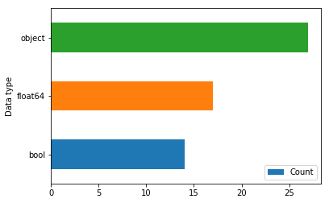

This shows that the dataset is mainly comprised of categorical features and hinted that a classifier like Random Forest may yield the best results. This also confirmed the importance of using preprocessing steps to make these categorical features usable by the classification models.

**Null values**

It was established in the previous section that there a number of features with a number of null samples. The following visualization allows a better understanding of the extent of the problem.

<!--
```python
null_value_counts = []
for col in raw_data:
    null_value_counts.append((col, raw_data[col].isnull().sum()))
pd.DataFrame(null_value_counts, columns=['Column', 'NullValueCount']).plot(x='Column', y='NullValueCount', kind='barh', figsize=(5,15))
```
-->

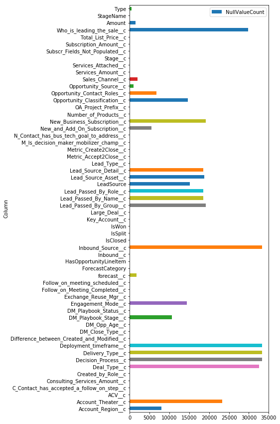

This revealed that a number of the features are mainly comprised of null samples. These are not valuable and should be dropped.

It also showed that some features contain a small number of null samples. These features could still be useful, so a processing step that fills these null samples could be enough to retain the value of the feature in the dataset.


**Categorical features with high dimensionality**

Where there is categorical data, it can be problematic for a single feature to have too many categories in the dataset. Features of this nature are low value but some feature engineering could be used to restore value while preserving the feature.

The following visualizations show the extent of high dimensionality problem in the dataset.

<!--
```python
high_dimension_categorical_features = []
for index, dtype in enumerate(raw_data.dtypes):
    col = raw_data.columns[index]
    if dtype == 'object':
        unique_value_count = len(raw_data[col].unique())
        # The magic number here is 18 since that is the number of stages         
        if unique_value_count > 18:
            high_dimension_categorical_features.append((col, unique_value_count))

high_dimension_categorical_features = pd.DataFrame(high_dimension_categorical_features, columns=['Column', 'UniqueValueCount'])
display(high_dimension_categorical_features)
high_dimension_categorical_features.plot.barh(x='Column',y='UniqueValueCount')
```
-->

<div>
<style scoped>
    .dataframe tbody tr th:only-of-type {
        vertical-align: middle;
    }

    .dataframe tbody tr th {
        vertical-align: top;
    }

    .dataframe thead th {
        text-align: right;
    }
</style>
<table border="1" class="dataframe">
  <thead>
    <tr style="text-align: right;">
      <th></th>
      <th>Column</th>
      <th>UniqueValueCount</th>
    </tr>
  </thead>
  <tbody>
    <tr>
      <th>0</th>
      <td>Account_Region__c</td>
      <td>22</td>
    </tr>
    <tr>
      <th>1</th>
      <td>Created_by_Role__c</td>
      <td>183</td>
    </tr>
    <tr>
      <th>2</th>
      <td>Lead_Passed_By_Name__c</td>
      <td>352</td>
    </tr>
    <tr>
      <th>3</th>
      <td>Lead_Passed_By_Role__c</td>
      <td>211</td>
    </tr>
    <tr>
      <th>4</th>
      <td>LeadSource</td>
      <td>48</td>
    </tr>
    <tr>
      <th>5</th>
      <td>Lead_Source_Asset__c</td>
      <td>819</td>
    </tr>
    <tr>
      <th>6</th>
      <td>Lead_Source_Detail__c</td>
      <td>207</td>
    </tr>
  </tbody>
</table>
</div>


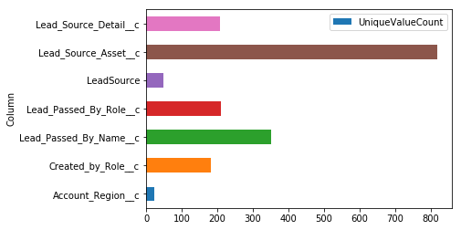


This tells that there are indeed a number of features in the dataset with high dimensionality. This will be addressed with feature engineering that employs some kind of unsupervised clustering step like `sklearn.cluster.FeatureAgglomeration`.

**Labels**

Since this project aims to build a model that can predict which opportunities will convert to be won, the dataset must have some label to indicate which opportunities were _Closed Won_ and which were _Closed Lost_. An inspection of the column names in the dataset revealed a number of features that were potentially suitable for providing the labels for training, as the visualizations below illustrate.

The columns identified as potential labels were:

* `StageName`
* `Stage__c`
* `DM_Close_Type__c`
* `IsWon`


**StageName**

```python
pd.value_counts(raw_data['StageName']).plot.bar()
```

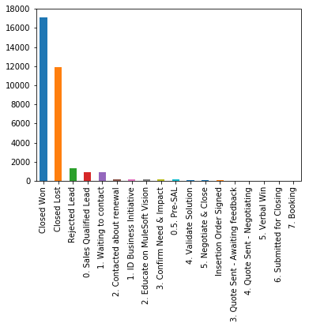


This shows that the bulk of the samples have a value of **'Closed Won'** or **'Closed Lost'** in the `StageName` feature so this could be used as the label column if the samples that do not have one of these values were removed.

**Stage__c**

```python
pd.value_counts(raw_data['Stage__c']).plot.bar()
```


This chart made it clear that the `Stage__c` feature is an exact copy of the `StageName` feature.


**DM\_Close\_Type__c**

```python
pd.value_counts(raw_data['DM_Close_Type__c']).plot.bar()
```

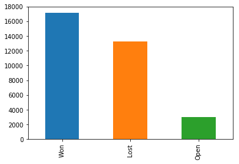

The plot for the `DM_Close_Type__c` feature shows that this contains different categories than the previous two features. Instead of having many different stage names, this feature classifies each sample as either _Won_, _Lost_ or _Open_.

Comparing this chart to the previous plot of the `StageName` feature, a correlation can clearly be seen with _Won_ to _Closed Won_ but there is not such a clear correlation between _Lost_ and _Closed Lost_.


**IsWon**

```python
pd.value_counts(raw_data['IsWon']).plot.bar()
```

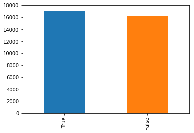

Lastly, the `IsWon` feature is a boolean flag indicating whether or not that opportunity has been won or lost. Also, a clear correlation can be seen when comparing this chart with the previous plot of the `DM_Close_Type__c` feature: the _False_ values in the `IsWon` feature are the sum of the _Closed Lost_ and _Open_ values and the _True_ values are directly correlated with the _Closed Won_ values.

Out of the various options for obtaining labels for the opportunities dataset, the `IsWon` feature is best because it is already a binary feature and requires no further processing other than label encoding.

These visualizations also helped establish that the other features will be highly correlated with the labels so a preprocessing step to drop these features will be necessary.

Lastly, the visualizations demonstrated that some samples in the `IsWon`=_False_ class are actually opportunities that are still "open". Since this project seeks to create a binary classification model, these samples should be dropped from the dataset as they could cause some opportunities to be wrongly predicted as being lost.


**Correlations**

When creating visualizations of the potential candidate features for labelling the dataset, it was established that there some features that are highly correlated with the chosen label feature. This section visualizes these correlations in order to better understand what additional preprocessing will be required.

<!--
```python
print(high_dimension_categorical_features['Column'])
```

    0         Account_Region__c
    1        Created_by_Role__c
    2    Lead_Passed_By_Name__c
    3    Lead_Passed_By_Role__c
    4                LeadSource
    5      Lead_Source_Asset__c
    6     Lead_Source_Detail__c
    Name: Column, dtype: object


```python
import utils

# drop high dimensional features so we don't blow up the dataset
corr_data = raw_data.drop(high_dimension_categorical_features['Column'].values, axis='columns')
# drop columns with 90% null values
row_count, col_count = corr_data.shape
na_threshold = int(round(row_count * 0.9))
corr_data = corr_data.dropna(thresh=na_threshold, axis='columns')
display(corr_data.shape)
# backfill the remaining null values
corr_data = corr_data.fillna(method='backfill', axis='columns')
# one hot encoding
encoded_corr_data = utils.encode(corr_data)
display(encoded_corr_data.shape)
```


    (33338, 37)


    (33338, 141)


```python
# only run correlation analysis on a sample of the dataset to save time
row_count = encoded_corr_data.shape[0]
encoded_corr_data = encoded_corr_data.sample(int(row_count * 0.1)).dropna(axis='columns')
```


```python
display(encoded_corr_data.shape)
corr = encoded_corr_data.corr().abs()
```


    (3333, 140)


```python
# Generate a mask for the upper triangle
mask = np.zeros_like(corr, dtype=np.bool)
mask[np.triu_indices_from(mask)] = True

# Set up the matplotlib figure
f, ax = plt.subplots(figsize=(11, 9))

# Generate a custom diverging colormap
cmap = sns.diverging_palette(220, 10, as_cmap=True)

# Draw the heatmap with the mask and correct aspect ratio
sns.heatmap(corr, mask=mask, cmap=cmap, vmax=.3, center=0,
            square=True, linewidths=.5, cbar_kws={"shrink": .5})
```
-->


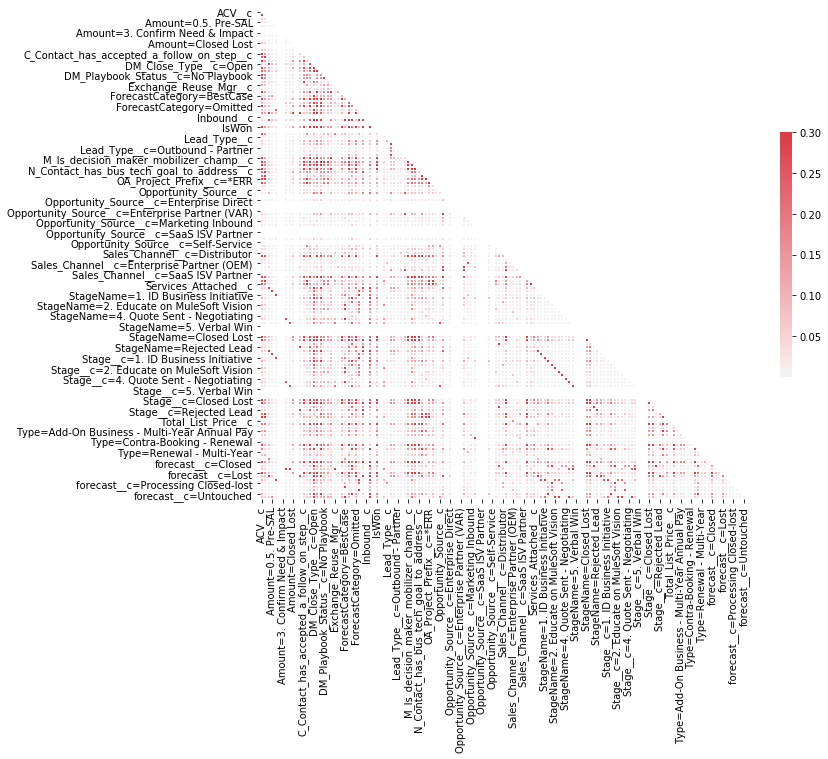


This high level visual shows there are indeed highly correlated features, but it's hard to tell from this chart which is which. A cursory look hints that the high correlations look predominantly like proxies for our labels.


```python
is_won = encoded_corr_data['IsWon']
corr_with = encoded_corr_data.corrwith(is_won, axis=0)
corr_with.abs()[corr_with > 0.5].plot(kind='barh', figsize=(5,15))
```

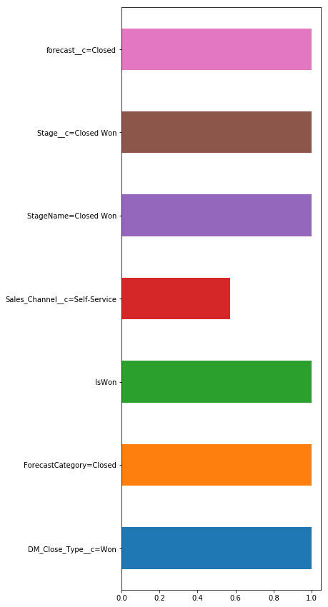

Further exploration on the intuition above reveals the features that are most highly correlated with the chosen label. These features should be dropped from the dataset during preprocessing so as to avoid any negative effects on the training of the classifiers.

### Algorithms and Techniques

This project will emply a number of different algorithms, mainly from the _sci-kit learn_ libraries. The notable exceptions being the classifiers from the _Microsoft LightGBM_ and _XGBoost_ libraries.

The algorithms fall broadly into two categories: data processing utilities and classifiers. The specific algorithms are listed below.

**Classifiers**

Five classifiers will be used during model selection and a dummy classifier will be employed for benchmarking.

| Classifier               | Library                |
| ------------------------ | ---------------------- |
| `DummyClassifier`        | `sklearn.dummy`        |
| `LogisticRegression`     | `sklearn.linear_model` |
| `GaussianNB`             | `sklearn.naive_bayes`  |
| `RandomForestClassifier` | `sklearn.ensemble`     |
| `LGBMClassifier`         | `lightgbm.sklearn`     |
| `XGBClassifier`          | `xgboost`              |

<!--
```python
# Dummy classifier for creating a benchmark
from sklearn.dummy import DummyClassifier

# Real classifiers for model selection
from sklearn.linear_model import LogisticRegression
from sklearn.naive_bayes import GaussianNB
from sklearn.ensemble import RandomForestClassifier
import lightgbm as lgb
import xgboost as xgb

# import the project specific utils 
import utils

```
-->

For the initial model selection step, the classifiers were initialized with their default parameters. During the refinement step, the performant models that were taken forward had hyperparameters tuned using grid search with cross validation scored using the f1 score metric.


**Processing utilities**

A number of utilities were used for feature engineering, encoding, scaling, selection; cross validation and splitting the data into training and test datasets.

| Algorithm                            | Library                      | Use case                                                                        |
| ------------------------------------ | ---------------------------- | ------------------------------------------------------------------------------- |
| `DictVectorizer`                     | `sklearn.feature_extraction` | For one-hot-encoding the features dataset during the preprocessing phase        |
| `LabelEncoder`                       | `sklearn.preprocessing`      | For encoding the labels in the dataset                                          |
| `MaxAbsScaler`                       | `sklearn.preprocessing`      | Scaling the features during the refinement phase                                |
| `SelectKBest`, `mutual_info_classif` | `sklearn.feature_selection`  | For a feature selection step during the refinement phase                        |
| `FeatureAgglomeration`               | `sklearn.cluster`            | Reducing number of categories in some high dimensional categorical features     |
| `train_test_split`                   | `sklearn.model_selection`    | Splitting the features and labels into training and testing datasets            |
| `GridSearchCV`                       | `sklearn.model_selection`    | Tuning hyperparameters of the most performant models                            |
| `StratifiedKFold`                    | `sklearn.model_selection`    | Splitting the training data into smaller 'folds' to facilitate cross validation |
| `cross_val_score`                    | `sklearn.model_selection`    | Training and scoring the classifier during cross validation                     |

**Constants**

A number of constants were set up to configure these processing utilities.

```python
SPLIT_RANDOM_SEED = 42
SEARCH_RANDOM_SEED = 56
DCLF_RANDOM_SEED = 42
K_FOLD_RANDOM_SEED = 3
K_FOLDS = 50
K_FEATURES = 50
NA_THRESHOLD = 0.975
LABEL_COLUMN = 'IsWon'
TEST_SIZE = 0.2
```

### Benchmark

For the purposes of this project, it is sufficient to build a model that is demonstrably better than a guess. Thus, it is sufficient to use sci-kit learn's dummy classifier to build a fake model. Then, the performance of this dummy model will be measured using the same metric (**f1 score**) as will be used to asses the final model.

The mean **f1 score** of the cross validated dummy classifier then gives a benchmark against which to judge the final model.

<!--

```python
# Filter down the raw data to only include samples from opportunities that
# are won or lost
print('Raw data shape: ', raw_data.shape)
display(raw_data['DM_Close_Type__c'].unique())
benchmark_data = raw_data[raw_data['DM_Close_Type__c'].isin(['Lost','Won'])]
print('Benchmark data shape: ', benchmark_data.shape)
display(benchmark_data['DM_Close_Type__c'].unique())
display(benchmark_data['StageName'].unique())
```

    Raw data shape:  (33338, 58)


    array(['Lost', 'Open', 'Won'], dtype=object)


    Benchmark data shape:  (30339, 58)


    array(['Lost', 'Won'], dtype=object)


    array(['Closed Lost', 'Rejected Lead', 'Closed Won'], dtype=object)


```python
# Pull our labels out from the benchmark data and encode them
labels = np.asarray(benchmark_data[LABEL_COLUMN])
labels = LabelEncoder().fit_transform(labels)
benchmark_data = benchmark_data.drop([LABEL_COLUMN], axis='columns')
print('Benchmark data shape: ', benchmark_data.shape)
```

    Benchmark data shape:  (30339, 57)


```python
# First pass at dropping na columns
row_count, col_count = benchmark_data.shape
na_thresh = int(round(row_count * NA_THRESHOLD))
benchmark_data = benchmark_data.dropna(thresh=na_thresh, axis='columns')
print('Benchmark data shape: ', benchmark_data.shape)
```

    Benchmark data shape:  (30339, 34)


```python
# Backfill the remaining columns
benchmark_data = benchmark_data.fillna(method='backfill', axis='columns')
```


```python
# Deal with high dimensional features:
# - remove them from benchmark_data to new DataFrame
# - one hot encode both DataFrames
# - perform feature agglomeration on the high dimensional features
# - join the Dataframes together again
high_dimension_categorical_feature_names = []
for index, dtype in enumerate(benchmark_data.dtypes):
    col = benchmark_data.columns[index]
    if dtype == 'object':
        unique_value_count = len(benchmark_data[col].unique())
        # The magic number here is 18 since that is the number of stages         
        if unique_value_count > 18:
            high_dimension_categorical_feature_names.append(col)
high_dimension_categorical_features = benchmark_data[high_dimension_categorical_feature_names]
benchmark_data = benchmark_data.drop(high_dimension_categorical_feature_names, axis='columns')
print('High dimensional data shape: ', high_dimension_categorical_features.shape)
print('Benchmark data shape: ', benchmark_data.shape)
```

    High dimensional data shape:  (30339, 14)
    Benchmark data shape:  (30339, 20)


```python
# Encode and agglomerate high dimensional features
high_dimension_categorical_features = utils.encode(high_dimension_categorical_features)
print('High dimensional data shape: ', high_dimension_categorical_features.shape)
high_dimension_categorical_features = FeatureAgglomeration(n_clusters=32).fit_transform(high_dimension_categorical_features)
print('High dimensional data shape: ', high_dimension_categorical_features.shape)

# Encode the rest of the data
benchmark_data = utils.encode(benchmark_data)
print('Benchmark data shape: ', benchmark_data.shape)
```

    High dimensional data shape:  (30339, 202)
    High dimensional data shape:  (30339, 32)
    Benchmark data shape:  (30339, 40)


```python
# Deal with correlated features
labels_df = pd.DataFrame(labels, columns=['label'], dtype='float64')
benchmark_corr = benchmark_data.corr()

# Generate a mask for the upper triangle
mask = np.zeros_like(benchmark_corr, dtype=np.bool)
mask[np.triu_indices_from(mask)] = True

# Set up the matplotlib figure
f, ax = plt.subplots(figsize=(11, 9))

# Generate a custom diverging colormap
cmap = sns.diverging_palette(220, 10, as_cmap=True)

# Draw the heatmap with the mask and correct aspect ratio
sns.heatmap(benchmark_corr, mask=mask, cmap=cmap, vmax=.3, center=0,
            square=True, linewidths=.5, cbar_kws={"shrink": .5})
```

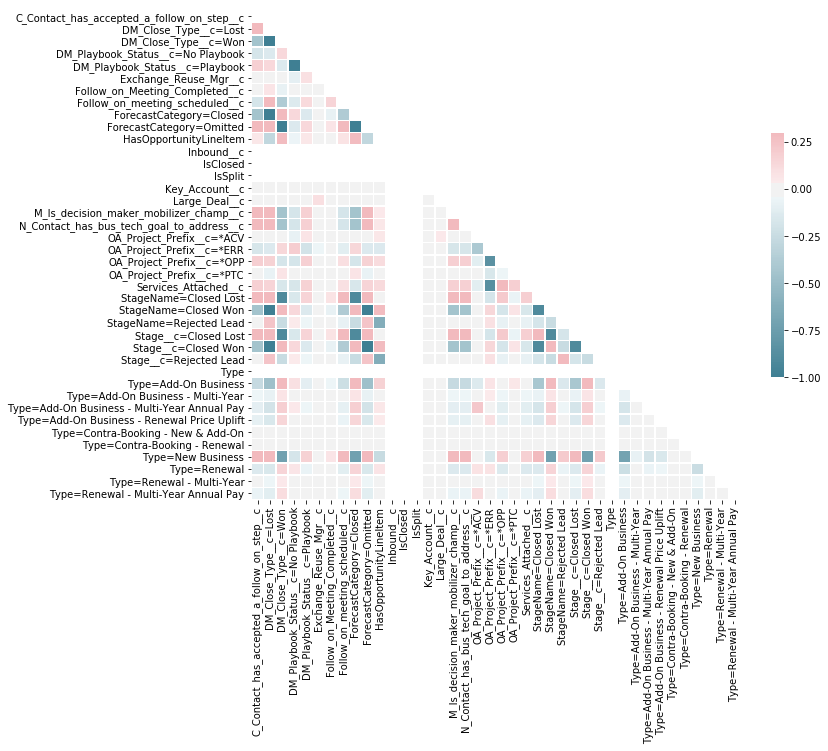


```python
corr_df = benchmark_data
corr_df['label'] = labels

corr = corr_df.corr()

# Generate a mask for the upper triangle
mask = np.zeros_like(corr, dtype=np.bool)
mask[np.triu_indices_from(mask)] = True

# Set up the matplotlib figure
f, ax = plt.subplots(figsize=(11, 9))

# Generate a custom diverging colormap
cmap = sns.diverging_palette(220, 10, as_cmap=True)

# Draw the heatmap with the mask and correct aspect ratio
sns.heatmap(corr, mask=mask, cmap=cmap, vmax=.3, center=0,
            square=True, linewidths=.5, cbar_kws={"shrink": .5})
```

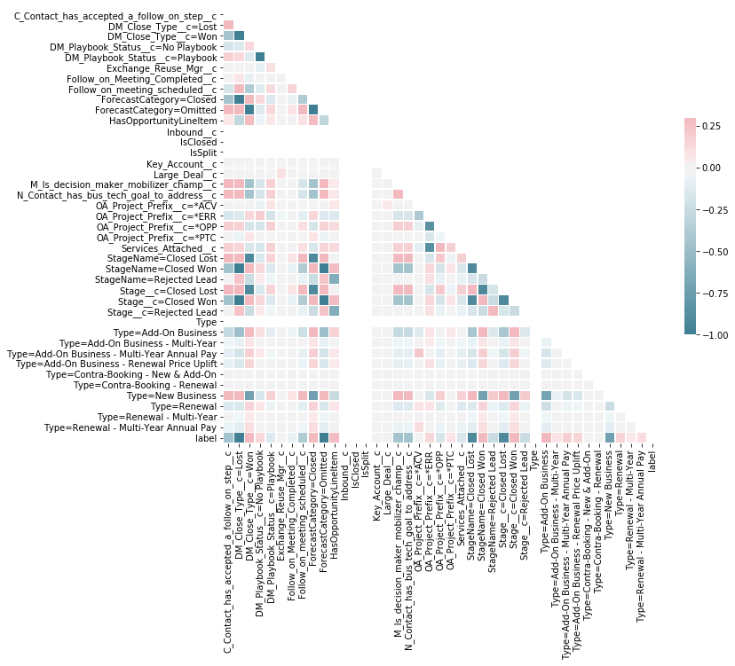


```python
corr['label'].abs()[corr['label'].abs() > 0.5].plot(kind='barh')
```

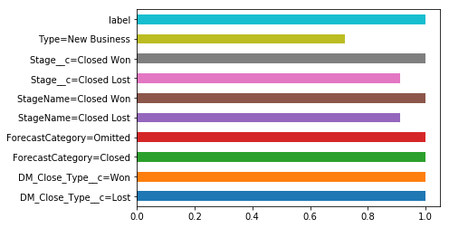


```python
# drop the correlated columns from the benchmark data
cols_to_drop = list(corr['label'].abs()[corr['label'].abs() > 0.5].drop(labels=['label']).keys())
benchmark_data = benchmark_data.drop(columns=cols_to_drop)
print('Benchmark data shape: ', benchmark_data.shape)
```

    Benchmark data shape:  (30339, 32)


```python
benchmark_data = benchmark_data.dropna(axis='columns')
```


```python
# join high dimensional data and rest of benchmark data
benchmark_array = np.hstack((np.asarray(benchmark_data), high_dimension_categorical_features))

print('High dimensional data shape: ', high_dimension_categorical_features.shape)
print('Benchmark data shape: ', benchmark_data.shape)
print('Benchmark array shape: ', benchmark_array.shape)
```

    High dimensional data shape:  (30339, 32)
    Benchmark data shape:  (30339, 31)
    Benchmark array shape:  (30339, 63)

-->

All the same data preprocessing steps that were used in the implementation were also used in preparing the data for the benchmark.

Then the data was split into training and testing sets and the `DummyClassifier` was trained using `StratifiedKFold` cross validation and the mean **f1 score** reported.

```python
# train test split
X_train, X_test, y_train, y_test = model_selection.train_test_split(
	benchmark_array,
	labels,
	test_size=TEST_SIZE,
	random_state=SPLIT_RANDOM_SEED)

dclf = DummyClassifier(random_state=DCLF_RANDOM_SEED)

kfold = model_selection.StratifiedKFold(n_splits=K_FOLDS, random_state=K_FOLD_RANDOM_SEED)

cv_results = model_selection.cross_val_score(
	dclf, 
	X_train,
	y_train,
	cv=kfold,
	scoring=f1_scorer)
```

    'Mean f1_score from StratifiedKFold cross validation 0.56'


The DummyClassifier achieves an average **f1 score** of **56%**. This establishes a baseline for assessing the success of the final modal. Given the dataset, a guess could be expected to be accurate in 56% of predictions. In order to demonstrate that the final model built in the project is better than a guess, it must a achieve a better average **f1 score** than **56%**.

## 3. Methodolgy

This section of the report will step through the execution phase of the project from data preprocessing through implementation.

### Data Preprocessing

As indentified in the data exploration and exploratory visualizations section of the project, a number of data preprocessing steps were identified. The list of necessary steps in order is as follows:

* Load the raw dataset
* Filter the samples down to only those that include the labels that are useful for purposes here: Closed won and Closed lost
* Separate the labels column from the features and encode them
* Drop features that have too many null samples and backfill the remaining the features
* Separate out categorical features with too many dimensions for further processing
* One-hot-encode the high dimensional features and use `FeatureAgglomeration` to reduce the resulting number of encoded features
* One-hot-encode the rest of the features dataset
* Drop features that are highly correlated with the labels
* Write the processed dataset to CSV and make a final inspection
* Final prep of the features dataset as a numpy array
* Split data into training and testing sets

----------------------------------------------------------------------

**Load the raw dataset**

<!-- 
```python
raw = pd.read_csv('data/csv/raw_data.csv', low_memory=False)
print('Raw data shape: ', raw.shape)
```

    Raw data shape:  (33338, 58) -->

The `pandas` library `read_csv()` method was used to import the raw data into a DataFrame. The number of rows and columns in the dataframe were reported as samples and features in the dataset were reported as 33,338 and 58 respectively.

**Filter the samples down to only those that include the labels that are useful for purposes here: _Closed Won_ and _Closed Lost_**

<!-- ```python
df = raw[raw['DM_Close_Type__c'].isin(['Lost','Won'])]
print('df shape: ', df.shape)
```

    Features shape:  (30339, 58) -->

The `DM_Close_Type__c` feature was used to filter the dataframe to only include records with samples in this column matching _'Lost'_ **or** _'Won'_. The number of samples in the dataset dropped to 30,339. 

**Separate the labels column from the features and encode them**

<!-- ```python
labels = np.asarray(df[LABEL_COLUMN])
labels = LabelEncoder().fit_transform(labels)
df = df.drop([LABEL_COLUMN], axis='columns')
print('df shape: ', df.shape)
print('labels shape: ', labels.shape)
```

    Features shape:  (30339, 57)
    Labels shape:  (30339,) -->

`numpy`'s `asarray()` method was used to extract an array of the samples in the `IsWon` feature of the dataset. This array was then passed through the `LabelEncoder().fit_transform()` method to encode the boolean values as 1 or 0. The `IsWon` feature was then dropped form the features dataset.

**Drop columns that have too many rows without a value and backfill the remain the columns**

<!-- ```python
# First pass at dropping na columns
row_count, col_count = df.shape
na_thresh = int(round(row_count * NA_THRESHOLD))
df = df.dropna(thresh=na_thresh, axis='columns')
print('df shape: ', df.shape)
```

    Features shape:  (30339, 34)


```python
# Backfill the remaining columns
df = df.fillna(method='backfill', axis='columns')
``` -->

A threshold value for the number of allowable null samples was calculated by multiplying the `NA_THRESHOLD` constant percentage by the total samples and this number was passed to the `dropna()` method on the features DataFrame. This dropped the number of features in the dataset from 57 to 34.

The `fillna()` method on the features DataFrame was then used with a `backfill` strategy to fill all the remaining null samples.

**Separate out categorical features with too many dimensions for further processing**

<!-- ```python
# Pick out high dimensional features 
hd_feature_names = []
for index, dtype in enumerate(df.dtypes):
    col = df.columns[index]
    if dtype == 'object':
        unique_value_count = len(df[col].unique())
        # The magic number here is 18 since that is the number of stages         
        if unique_value_count > 18:
            hd_feature_names.append(col)
hd_features = df[hd_feature_names]
df = df.drop(hd_feature_names, axis='columns')
print('High dimensional data shape: ', hd_features.shape)
print('df shape: ', df.shape)
```

    High dimensional features shape:  (30339, 14)
    Features shape:  (30339, 20) -->

To pick out the categorical features with high dimensionality, the features were looped over and if the data type was on object (i.e. text) the `unique()` method on the DataFrame Series was used to establish how many unique values were in the given feature. If this number was greater than 18, the feature name was added to a list.

The features were then extracted by name to their own DataFrame and dropped from the features dataset. The new high dimensional features dataset had 14 features, and the features dataset was left with 14.

>**NOTE** -  18 was selected as the maximum unique value to tolerate since this was the number of unique opportunity stages. The opportunity stage was decided as being the one categorical feature that all unique values should be preserved on.

**One-hot-encode the high dimensional features and use `FeatureAgglomeration` to reduce the resulting number of encoded features**

<!-- 
```python
hd_features = utils.encode(hd_features)
hd_features = FeatureAgglomeration(n_clusters=32).fit_transform(hd_features)
``` -->

The high dimensional features are encoded using the `DictVectorizer().fit_transform()` method then the number of features is reduced by using `FeatureAgglomeration(n_clusters=32).fit_transform()` method.

The resulting dataset has 32 features.

**One-hot-encode the rest of the features dataset**

<!-- 
```python
df = utils.encode(df)

print('High dimensional data shape: ', hd_features.shape)                           
print('df shape: ', df.shape)
```

    High dimensional features shape:  (30339, 32)
    Features shape:  (30339, 40) -->

The features are encoded using the `DictVectorizer().fit_transform()` method.

The resulting dataset has 40 features.

**Drop features that are highly correlated with the labels**

First, a new DataFrame is created and it's `corr()` method is used to compile the correlations data. Then those features with a correlation higher than 0.5 were plotted for inspection.

<!-- 
```python
corr_df = df.copy(deep=True)
corr_df['label'] = labels

corr = corr_df.corr()
corr['label'].abs()[corr['label'].abs() > 0.5].plot(kind='barh')
``` -->


On inspecting the feature names, it's clear that these are correlations that were anticipated during the Exploratory Visualizations phase, so the features are dropped from the dataset.

The features dataset drops from 40 to 30 features.

<!-- 
```python
cols_to_drop = list(corr['label'].abs()[corr['label'].abs() > 0.5].drop(labels=['label']).keys())
df = df.drop(columns=cols_to_drop)
print('df shape: ', df.shape)
```

    Features shape:  (30339, 31) -->

**Final prep of the features dataset as a numpy array**

<!-- 
```python
features = np.hstack((np.asarray(df), hd_features))

print('High dimensional data shape: ', hd_features.shape)
print('df shape: ', df.shape)
print('Features array shape: ', features.shape)
print('Labels array shape: ', labels.shape)
```

    High dimensional features shape:  (30339, 32)
    Features shape:  (30339, 30)
    Combined Features array shape:  (30339, 62)
    Labels array shape:  (30339,) -->

`numpy`'s `hstack()` method was used to join the encoded features and high dimensional features datasets into one 2d array.

**Split data into training and testing sets**

Lastly the features and labels were split into training and test datasets using the `train_test_split` algorithm supplied with the `TEST_SIZE` constant of 20%.

<!-- ```python
# train test split
X_train, X_test, y_train, y_test = model_selection.train_test_split(features, labels, test_size=TEST_SIZE, random_state=SPLIT_RANDOM_SEED)
``` -->

### Implementation

With the data now processed and split into training and test datasets, the implementation phase trained five classifiers using K-Fold cross validation scored with the **f1 score** metric. When the training was completed the mean score for each model was reported and plotted for review.

```python
models = []
models.append(('LR', LogisticRegression()))
models.append(('NB', GaussianNB()))
models.append(('RF', RandomForestClassifier()))
models.append(('LGBM', lgb.sklearn.LGBMClassifier(objective='binary')))
models.append(('XGB', xgb.XGBClassifier(objective='binary:logistic')))
```

First, a `list` data structure was created to contain each model by storing a tuple of `(name, classifier)`.

```python
results = []
names = []

for name, model in models:
    kfold = model_selection.StratifiedKFold(
        n_splits=K_FOLDS,
        shuffle=True,
        random_state=K_FOLD_RANDOM_SEED)
    
    cv_results = model_selection.cross_val_score(
        model,
        X_train,
        y_train,
        cv=kfold,
        scoring=f1_scorer)
    
    results.append(cv_results)
    names.append(name)
```

This data structure was then looped over and each classifier was trained using the `cross_val_score` algorithm supplied with the `f1_scorer` and `StratifiedKFold` objects to manage the cross validation datasets and scoring the performance of the classifier.

The results were tracked in separate `list` data structures and results reported in a list and a box plot.


    LR: 0.802138 (0.110129)
    NB: 0.720277 (0.001949)
    RF: 0.952648 (0.010811)
    LGBM: 0.962710 (0.009271)
    XGB: 0.958668 (0.010180)


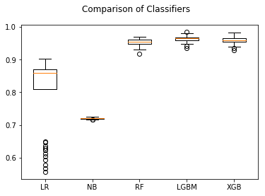

It was clear from this that the implementation yielded 5 models that all out-performed the benchmark by a considerable margin. Within the 5 models, the most succesful were Random Forest, LightGBM and XGBoost - all achieving a mean **f1 score** above 95%.


### Refinement

While the results reported during implementation are encouraging, there is room for improvement for the following reasons.

There can often be a significant difference between scores obtained during cross validation and those obtained in testing.

The variance in scores for each StratifiedKFold pass across each model is quite disparate - it would be better for these to be more consitent

The large gap in performance between the Logistic Regression classifier and the Random Forest / Gradient Boosting classifiers also suggests that the latter classifiers may be over fitting (especially since these classifiers are more prone to overfitting generally).

To try to improve upon the cross validation results, the following steps were taken:

* Feature scaling
* Feature selection
* Repeat the cross validation with the refined dataset on the same classifiers
* Identify the two most performant classifiers and train models from them using grid search with cross validation


**Feature scaling**

The features were scaled using the default settings on the `MaxAbsScaler()` algorithm.

```python
X_train = MaxAbsScaler().fit_transform(X_train)
X_test = MaxAbsScaler().fit_transform(X_test)
```

**Feature selection**

The total number of features passed to classifiers was then reduced using the `SelectKBest()` algorithm supplied with the default `mutual_info_classif` classifier and the `K_FEATURES` constant as defined earlier.

```python
X_train = SelectKBest(
    score_func=mutual_info_classif,
    k=K_FEATURES).fit_transform(X_train, y_train)

X_test = SelectKBest(
    score_func=mutual_info_classif,
    k=K_FEATURES).fit_transform(X_test, y_test)
```

**Repeat the cross validation with the refined dataset on the same classifiers**

Using the same steps defined in the Implementation phase, the classifiers were trained using cross validation on the refined datasets.

As before, the results were reported in a list and a boxplot.

    LR: 0.933005 (0.010656)
    NB: 0.913139 (0.011102)
    RF: 0.954264 (0.008907)
    LGBM: 0.962676 (0.008479)
    XGB: 0.958288 (0.009226)


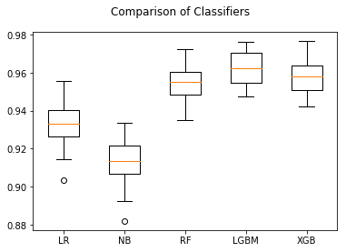

The results of this stage of refinement are very interesting in that the performance of the Naive Bayes and Logistic Regression models improved significantly while the Random Forest and Gradient Boosting classifiers stayed around the same.

It was also noteworthy that the spread of results for each StratifiedKFold were much more evenly spread - the standard deviation for each model was around 1%.

**Identify the two most performant classifiers and train models from them using grid search with cross validation**

The win for most performant model is a two way tie between Light GBM and XGBoost - both scoring a mean **f1 score** of 96%. A very close third is Random Forest with a score of 95%. However, given that the Light GBM and XGBoost are very similar, it would be more prudent to select a different second model to take forward for hyperparameter tuning: the results from two similar classifiers are not likely to vary enough for this to be valuable.

The two selected classifiers are therefore Light GBM and Logistic Regression.

The parameter sets supplied to the `GridSearchCV` algorithm were as follows:

```python
grid_params = {
    'LR': {
        'C': np.logspace(-3,3,7),
        'penalty': ['l1', 'l2']
    },
    'LGBM': {
        'learning_rate': [0.1, 0.01, 0.005],
        'num_leaves': [6,8,12,16],
        'n_estimators': [50,100,200],
        'objective' : ['binary'],
        'random_state': [42]
    }
}
```

The same scoring and kfold objects were used again in this round of cross validation and the best score of each classifier was reported.

    LR 0.939812380966
    LGBM 0.962049929935

After hyperparameter tuning using grid search with cross validation, the Logistic Regression classifier has improved by 1% to achieve a best score of **94%**. The Light GBM has stayed the same at **96%**.

## 4. Results

### Model Evaluation and Validation

With the datasets refined and the classifier hyperparameters optimized, the models were use to make predictions against the previously unseen test datasets using the `predict()` method on each model.

These predictions were then scored against the actual labels using the **f1 score** metric and the results reported in a list.

```python
final_scores = []

for name, clf in tuned_models:
    y_pred = clf.predict(X_test)
    score = f1_score(y_test, y_pred)
    final_scores.append((name, score))
```

    LR 0.9405911618378695
    LGBM 0.9662657670871223
    
This last test shows that the models generalize well to unseen data: they both receive a slightly better **f1 score** when making predictions against the previously unseen test dataset.

That both models can achieve an **f1 score** above 94% shows the results are robust and can be trusted. The **f1 score** metric itself lends confidence that the results are not just full of false positives.

However, it is hard to pick a clear winner because the scores are so close. I am tempted to pick Logistic Regression as it is a simpler model and less prone to over-fitting.

### Jusitifcation

The model clearly surpasses the benchmark set earlier and seems to provide a more than adequate solution to the problem of opportunity classification. This project can conclude that the machine learning model can make predictions about which opportunities will close in a winning or losing state that are better than a guess. This could prove to be a very useful tool for BizOps professionals who need to make a large number of these prodictions quickly in order to better understand a sales pipeline.

## 5. Conclusion

### Reflection

This project can be summarized as follows:

* A problem was identified that can potentially be solved with machine learning
* A method of scoring an machine learning model was devised
* A dataset was created, analyzed, visualized and preprocessing steps identified
* A number of suitable algorithms were identified for binary classification of opportunity records and forpreprocessing of the dataset
* A benchmark was established - effectively putting a % on "how good is a guess?"
* The dataset was processed accoring to steps identified earlier:
	* Establish labels
	* Drop unwanted features and samples
	* Encode the categorical data
	* Reduce dimensionality in categorical data with too many categorie
	* Drop correlated features 
	* Split the data into training and test datesets
* Models were trained and cross validated using the selected classifiers
* The dataset was refined to improve the performance of the classifiers:
	* Feature scaling
	* Feature selection
	* Models were retrained and cross validated with improvements noted
* The most performant classifiers were then tuned using a set of hyperparameter options and a grid search cross validation strategy
* The best classifiers from the grid search were tested on unseen data to confirm that they generalize
* The best model was to solve the problem was identified

There most interesting parts of the project were also the hardest. At first, training the classifiers took far too long becuase the dataset - once one-hot-encoded - had hundreds of features. Reducing the number of features by identifying and reducing high dimensional categorical features was very successful in keeping the overall number of features to sensible level that could be processed quickly without the performance of the models suffering.

The next difficult and interesting part of the project was discovering that, on first attempt, the classifiers were all scoring almost 100%. This led me to discover that a number of encoded features were actually proxies for the labels and therefore were creating models that were completely overfit. Figuring out how to programmatically identify and remove these features was an interesting challenge.

The most surprising part of the project was seeing how much the Logistic Regression classifier improved after passing the features dataset through feature scaling and selection. This ultimately made a massive difference to the project as the Logistic Regression model was chosen as the best tool for solving the problem over LightGBM.

The final model passed it's benchmark criteria of being "better than a guess" - it's 96% **f1 score** far exceed the 56% scored by the dummy classifier.

The final model exceed my personal expectations and I would certainly consider using it in a production situation after some more testing on different data. My biggest concern would be that the data is overfit to this particular customer's data.

I think the results here are interesting enough to suggest that there is scope for using the same approach to build models for classifing leads and accounts in terms of whether they will or will not convert to opportunities or renewals respectively.

### Improvement

There is always room for improvement. As mentioned, the biggest concern here is that the model will be overfit to this particular customer's data. In order to improve how well the model generalizes, it should be trained, cross validated and tested against a dataset that is comprised of data from multiple customer sources. If good results can be obtained under these circumstances, the model could then be used with confidence in a production setting.
